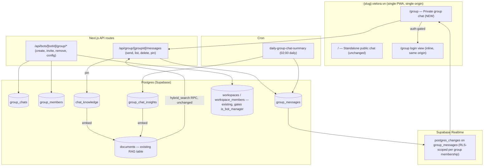
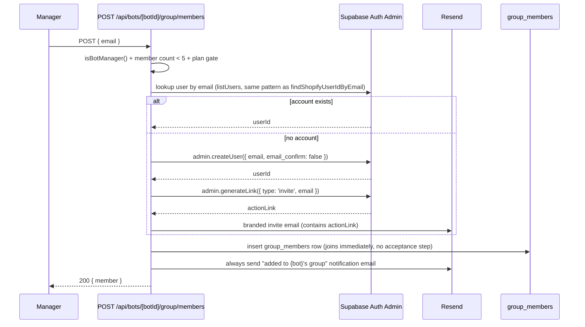
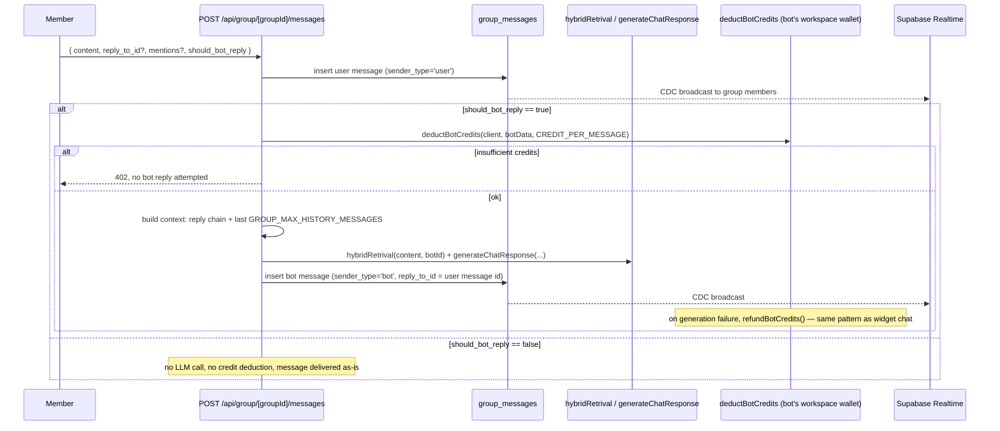

# Vielora Group Chat — Technical Specification

**Version:** v0.2.0 (2026-08-10 — §0 blocking questions RESOLVED against codebase; supersedes v0.1.0 draft)
**Source of truth for scope:** `group-chat-decisions.md` (LOCKED 2026-08-10)
**Repository:** `Tmh3101/vielora` — branch `develop`
**Author:** Tech Lead (Minh Hiểu) + Hermes agent, grounded in current codebase (`lib/services/credit.service.ts`, `supabase/db-schema.sql`, `supabase/migrations/`)

---

## 0. Blocking Questions — RESOLVED (verified against code)

> v0.1.0 assumed **no workspace concept exists** ("workspace member = bot owner"). That assumption was **WRONG** — the workspace model is live in both schema and code. §0.1 and §0.2 are corrected below with file:line evidence. §0.3/§0.4 confirmed unchanged.

| # | Question | Resolution (evidence) | Decision used in this spec |
|---|---|---|---|
| 0.1 | Does a workspace/team model exist? Who is a "workspace member"? | **YES — full model exists.** `workspaces`, `workspace_roles` (owner/admin/member/viewer, permissions JSONB, hierarchy 100/80/50/10), `workspace_members` (role_id, status pending/active), `workspace_invitations` (token, 7-day expiry) — `db-schema.sql:988-1057`. `bots.workspace_id` added by migration `supabase/migrations/20260724_03_schema_modifications.sql:21` (idx_bots_workspace). RLS: `bots_all_own` (owner FOR ALL, `db-schema.sql:851`) + `bots_select_workspace_member` (active members SELECT only, `20260724_03_workspace_member_rls.sql`). | `is_bot_manager()` = bot owner **OR** active workspace member with role owner/admin (hierarchy >= 80) of the bot's workspace. Workspace member/viewer (50/10) can only SELECT bots today — **not** managers. **One decision for Boss: confirm owner/admin (>= 80) is the right cut** — default assumes yes. |
| 0.2 | Which wallet pays for bot replies in a group? | **Workspace wallet — there is no "user's wallet".** `wallets` table is keyed by `workspace_id` (`db-schema.sql:509-518`); `deductBotCredits(client, bot, ...)` resolves `workspaceId = resolveWorkspaceId(client, bot)` and calls `deductWorkspaceCredits` (`lib/services/credit.service.ts:400-424`, `resolveWorkspaceId` at :369). A bot without `workspace_id` fails with "Bot has no workspace, cannot deduct credits". | Same path as widget chat: `deductBotCredits(client, botData, ...)` with the bot's workspace wallet. Invited members never have their own wallet. Group send is free; only bot replies deduct. |
| 0.3 | Realtime: Postgres CDC vs server broadcast? | Confirmed — no change. | **Postgres CDC**: `ALTER PUBLICATION supabase_realtime ADD TABLE public.group_messages`; RLS scopes delivery per membership. |
| 0.4 | Invite email: Supabase built-in vs Resend? | Confirmed — no change. | **Resend** branded template; link obtained via `supabase.auth.admin.generateLink({ type: 'invite' })` / `magiclink`. |

### 0.1a Plan gating (new — workspace-aware)

Plans now live on **workspace subscriptions** (`subscriptions.workspace_id`, `db-schema.sql:1286-1294`; enterprise plan + overrides in `20260803120000_add_enterprise_plan_and_overrides.sql`). Group chat must gate on the **bot's workspace subscription**, not a per-user plan. During Phase 2, verify whether `getUserActivePlanCodeServer()` (used by `AI_CONFIG_REQUIRED_PLAN` in `app/api/bots/[botId]/config/route.ts`) resolves through the bot's workspace or the requesting user's own workspace; if user-based, add a workspace-aware helper (`getBotWorkspaceActivePlanCodeServer(botId)`) and use it for the group gate.

---

## 1. Architecture Overview



Key principle: **service-layer pattern** (`lib/services/group-chat.service.ts`, `group-member.service.ts`, `chat-knowledge.service.ts`), all accepting `ServiceClient` first, mirroring `bot.service.ts` / `credit.service.ts`.

---

## 2. Config Constants (new file: `config/group-chat.ts`)

```ts
import { ESubscriptionPlan } from "@/types";

export const GROUP_MAX_MEMBERS = 5; // excludes the bot itself
export const GROUP_MAX_HISTORY_MESSAGES = 25; // vs. MAX_HISTORY_MESSAGES = 3 for standalone (config/rag.ts)
export const GROUP_CHAT_ALLOWED_PLANS: ESubscriptionPlan[] = [
  ESubscriptionPlan.Pro,
  ESubscriptionPlan.Enterprise,
];
export const GROUP_HISTORY_RETENTION_DAYS: number | null = null; // indefinite in MVP
export const GROUP_SUMMARY_CRON = "0 2 * * *"; // 02:00 daily
export const GROUP_SUMMARY_WINDOW_DAYS = 30; // rolling window in group_chat_insights
export const GROUP_INVITE_SESSION_REFRESH_DAYS = 7;
export const GROUP_LAST_TAB_STORAGE_KEY = "vielora_group_last_tab"; // localStorage, per-origin
```

Plan gate is enforced at the **workspace subscription** level (§0.1a), not per-user.

---

## 3. Database Schema

### 3.1 New enum

```sql
DO $$ BEGIN
  CREATE TYPE public.group_message_sender_type AS ENUM ('user', 'bot');
EXCEPTION
  WHEN duplicate_object THEN null;
END $$;
```

### 3.2 `group_chats` — one row per bot, 1:1 via UNIQUE (bot_id)

```sql
CREATE TABLE public.group_chats (
  id uuid DEFAULT gen_random_uuid() NOT NULL,
  bot_id uuid NOT NULL,
  status text NOT NULL DEFAULT 'active', -- 'active' | 'disabled'
  created_by uuid NOT NULL,             -- auth.users.id (bot owner at creation time)
  created_at timestamptz DEFAULT now() NOT NULL,
  updated_at timestamptz DEFAULT now() NOT NULL,
  CONSTRAINT group_chats_pkey PRIMARY KEY (id),
  CONSTRAINT group_chats_bot_id_key UNIQUE (bot_id),
  CONSTRAINT group_chats_bot_id_fkey FOREIGN KEY (bot_id) REFERENCES public.bots(id) ON DELETE CASCADE,
  CONSTRAINT group_chats_status_check CHECK (status IN ('active', 'disabled'))
);

CREATE TRIGGER update_group_chats_updated_at
  BEFORE UPDATE ON public.group_chats
  FOR EACH ROW EXECUTE FUNCTION update_updated_at_column();
```

Creation is **manual** (owner clicks "Tạo nhóm chat" in dashboard) — no auto-creation on plan upgrade. `status = 'disabled'` is the downgrade switch (§12 Phase 9), preserving history instead of hard-delete.

### 3.3 `group_members`

```sql
CREATE TABLE public.group_members (
  id uuid DEFAULT gen_random_uuid() NOT NULL,
  group_id uuid NOT NULL,
  user_id uuid NOT NULL,             -- auth.users.id
  email text NOT NULL,               -- snapshot at invite time
  role_label text NULL,              -- free-form tag, NO permission semantics
  can_pin_knowledge boolean NOT NULL DEFAULT false,
  invited_by uuid NOT NULL,          -- auth.users.id of the inviter
  last_read_at timestamptz NULL,
  joined_at timestamptz DEFAULT now() NOT NULL,
  CONSTRAINT group_members_pkey PRIMARY KEY (id),
  CONSTRAINT group_members_group_user_unique UNIQUE (group_id, user_id),
  CONSTRAINT group_members_group_id_fkey FOREIGN KEY (group_id) REFERENCES public.group_chats(id) ON DELETE CASCADE,
  CONSTRAINT group_members_user_id_fkey FOREIGN KEY (user_id) REFERENCES auth.users(id) ON DELETE CASCADE
);

CREATE INDEX idx_group_members_group_id ON public.group_members (group_id);
CREATE INDEX idx_group_members_user_id ON public.group_members (user_id);

-- Backstop: max 5 members (bot is not a row here)
CREATE OR REPLACE FUNCTION public.enforce_group_member_limit()
RETURNS trigger LANGUAGE plpgsql SET search_path = public AS $function$
BEGIN
  IF (SELECT COUNT(*) FROM public.group_members WHERE group_id = NEW.group_id) >= 5 THEN
    RAISE EXCEPTION 'GROUP_MEMBER_LIMIT_REACHED';
  END IF;
  RETURN NEW;
END;
$function$;

CREATE TRIGGER trg_enforce_group_member_limit
  BEFORE INSERT ON public.group_members
  FOR EACH ROW EXECUTE FUNCTION public.enforce_group_member_limit();
```

Trigger is defense-in-depth; the API pre-checks count so the UI shows "Nhóm đã đủ 5 thành viên" instead of a raw Postgres exception.

### 3.4 `group_messages`

```sql
CREATE TABLE public.group_messages (
  id uuid DEFAULT gen_random_uuid() NOT NULL,
  group_id uuid NOT NULL,
  sender_type public.group_message_sender_type NOT NULL DEFAULT 'user',
  sender_id uuid NULL,              -- auth.users.id when 'user'; NULL when 'bot'
  content text NOT NULL,
  reply_to_id uuid NULL,            -- self-ref; bot ALWAYS sets this on its replies
  mentions uuid[] NOT NULL DEFAULT '{}',
  should_bot_reply boolean NOT NULL DEFAULT true, -- per-message toggle, set by sender
  no_answer boolean NULL,           -- same fallback convention as public.messages
  deleted_at timestamptz NULL,      -- soft delete
  deleted_by uuid NULL,
  created_at timestamptz DEFAULT now() NOT NULL,
  CONSTRAINT group_messages_pkey PRIMARY KEY (id),
  CONSTRAINT group_messages_group_id_fkey FOREIGN KEY (group_id) REFERENCES public.group_chats(id) ON DELETE CASCADE,
  CONSTRAINT group_messages_reply_to_id_fkey FOREIGN KEY (reply_to_id) REFERENCES public.group_messages(id) ON DELETE SET NULL,
  CONSTRAINT group_messages_sender_id_fkey FOREIGN KEY (sender_id) REFERENCES auth.users(id) ON DELETE SET NULL
);

CREATE INDEX idx_group_messages_group_created ON public.group_messages (group_id, created_at);
CREATE INDEX idx_group_messages_reply_to ON public.group_messages (reply_to_id) WHERE reply_to_id IS NOT NULL;
CREATE INDEX idx_group_messages_mentions ON public.group_messages USING gin (mentions);
```

`deleted_at`/`deleted_by`: soft delete only (decision §9.2 — owner/admin any, member own). Deleted rows excluded from UI + bot context, **not** physically removed (keeps reply chains and `chat_knowledge` snapshots intact).

### 3.5 `chat_knowledge` (Layer A — manual pin)

```sql
CREATE TABLE public.chat_knowledge (
  id uuid DEFAULT gen_random_uuid() NOT NULL,
  bot_id uuid NOT NULL,
  group_id uuid NOT NULL,
  message_id uuid NULL,             -- snapshot survives message deletion
  question text NOT NULL,           -- snapshot of pinned user message
  answer text NULL,                 -- snapshot of bot's reply, if any
  pinned_by uuid NOT NULL,          -- auth.users.id
  document_id uuid NULL,            -- FK once embedded into documents
  created_at timestamptz DEFAULT now() NOT NULL,
  CONSTRAINT chat_knowledge_pkey PRIMARY KEY (id),
  CONSTRAINT chat_knowledge_bot_id_fkey FOREIGN KEY (bot_id) REFERENCES public.bots(id) ON DELETE CASCADE,
  CONSTRAINT chat_knowledge_group_id_fkey FOREIGN KEY (group_id) REFERENCES public.group_chats(id) ON DELETE CASCADE,
  CONSTRAINT chat_knowledge_message_id_fkey FOREIGN KEY (message_id) REFERENCES public.group_messages(id) ON DELETE SET NULL,
  CONSTRAINT chat_knowledge_document_id_fkey FOREIGN KEY (document_id) REFERENCES public.documents(id) ON DELETE SET NULL
);

CREATE INDEX idx_chat_knowledge_bot_id ON public.chat_knowledge (bot_id);
```

### 3.6 `group_chat_insights` (Layer B — daily cron summary, 1 row/bot)

```sql
CREATE TABLE public.group_chat_insights (
  bot_id uuid NOT NULL,
  group_id uuid NOT NULL,
  summary text NOT NULL DEFAULT '',
  document_id uuid NULL,
  last_summarized_message_at timestamptz NULL, -- watermark
  updated_at timestamptz DEFAULT now() NOT NULL,
  CONSTRAINT group_chat_insights_pkey PRIMARY KEY (bot_id),
  CONSTRAINT group_chat_insights_bot_id_fkey FOREIGN KEY (bot_id) REFERENCES public.bots(id) ON DELETE CASCADE,
  CONSTRAINT group_chat_insights_group_id_fkey FOREIGN KEY (group_id) REFERENCES public.group_chats(id) ON DELETE CASCADE,
  CONSTRAINT group_chat_insights_document_id_fkey FOREIGN KEY (document_id) REFERENCES public.documents(id) ON DELETE SET NULL
);
```

### 3.7 `documents` — no schema change, convention only

Both layers write into the **existing** `public.documents` table:

| Field | Layer A (pin) | Layer B (summary) |
|---|---|---|
| `bot_id` | pinned message's bot | insight's bot |
| `content` | `"Q: {question}\nA: {answer}"` (or question only) | `summary` text |
| `metadata.source` | `'group_chat'` | `'group_summary'` |
| `metadata.chatKnowledgeId` | `chat_knowledge.id` | — |
| cardinality | 1 row per pin (own embedding) | 1 row per bot, embedding regenerated each cron run (delete + reinsert, same pattern as indexer) |

`hybrid_search` RPC requires **zero changes** — it filters by `p_bot_id` only, agnostic to `metadata.source`. Satisfies decision §6 (knowledge applies to ALL contexts, incl. standalone).

### 3.8 Realtime publication

```sql
ALTER PUBLICATION supabase_realtime ADD TABLE public.group_messages;
```

### 3.9 Row Level Security

Permission helpers (workspace-aware — see §4):

```sql
-- Bot manager = bot owner OR active workspace owner/admin (hierarchy >= 80) of the bot's workspace
CREATE OR REPLACE FUNCTION public.is_bot_manager(p_bot_id uuid, p_user_id uuid)
RETURNS boolean
LANGUAGE sql
STABLE
SET search_path = public
AS $$
  SELECT EXISTS (
    SELECT 1 FROM public.bots b
    WHERE b.id = p_bot_id
      AND (
        b.user_id = p_user_id
        OR EXISTS (
          SELECT 1
          FROM public.workspace_members wm
          JOIN public.workspace_roles wr ON wr.id = wm.role_id
          WHERE wm.workspace_id = b.workspace_id
            AND wm.user_id = p_user_id
            AND wm.status = 'active'
            AND wr.hierarchy >= 80
        )
      )
  );
$$;

CREATE OR REPLACE FUNCTION public.is_group_member(p_group_id uuid, p_user_id uuid)
RETURNS boolean
LANGUAGE sql
STABLE
SET search_path = public
AS $$
  SELECT EXISTS (
    SELECT 1 FROM public.group_members WHERE group_id = p_group_id AND user_id = p_user_id
  );
$$;
```

```sql
ALTER TABLE public.group_chats ENABLE ROW LEVEL SECURITY;
ALTER TABLE public.group_members ENABLE ROW LEVEL SECURITY;
ALTER TABLE public.group_messages ENABLE ROW LEVEL SECURITY;
ALTER TABLE public.chat_knowledge ENABLE ROW LEVEL SECURITY;
ALTER TABLE public.group_chat_insights ENABLE ROW LEVEL SECURITY;

-- group_chats: manager full access; members read their own group's row
CREATE POLICY "group_chats_manager_all" ON public.group_chats FOR ALL
  USING (public.is_bot_manager(bot_id, auth.uid()));
CREATE POLICY "group_chats_member_select" ON public.group_chats FOR SELECT
  USING (public.is_group_member(id, auth.uid()));

-- group_members: manager full access; members read roster of own group; self-leave
CREATE POLICY "group_members_manager_all" ON public.group_members FOR ALL
  USING (public.is_bot_manager((SELECT bot_id FROM public.group_chats WHERE id = group_id), auth.uid()));
CREATE POLICY "group_members_self_select" ON public.group_members FOR SELECT
  USING (public.is_group_member(group_id, auth.uid()));
CREATE POLICY "group_members_self_leave" ON public.group_members FOR DELETE
  USING (user_id = auth.uid());

-- group_messages: members (and managers) read; members insert own human messages
CREATE POLICY "group_messages_member_select" ON public.group_messages FOR SELECT
  USING (public.is_group_member(group_id, auth.uid())
    OR public.is_bot_manager((SELECT bot_id FROM public.group_chats WHERE id = group_id), auth.uid()));
CREATE POLICY "group_messages_member_insert" ON public.group_messages FOR INSERT
  WITH CHECK (public.is_group_member(group_id, auth.uid()) AND sender_type = 'user' AND sender_id = auth.uid());
-- Soft-delete UPDATE handled server-side via service role only (own vs any is conditional
-- business logic, not a single RLS predicate) — see §5.4.

-- chat_knowledge / group_chat_insights: manager dashboard read/delete; writes are service-role only
CREATE POLICY "chat_knowledge_manager_all" ON public.chat_knowledge FOR ALL
  USING (public.is_bot_manager(bot_id, auth.uid()));
CREATE POLICY "group_chat_insights_manager_select" ON public.group_chat_insights FOR SELECT
  USING (public.is_bot_manager(bot_id, auth.uid()));
```

> **Bot messages** (`sender_type = 'bot'`) are always inserted via the **admin client** (service role bypasses RLS) — same as every bot-write path in the codebase (`createAdminClient()` throughout `lib/services`, `lib/scraper`). The member-insert policy only covers human messages.

---

## 4. Permission Model

Two fully independent axes, per decision §3:

1. **Bot-management authority** (`is_bot_manager`): bot owner **or** active workspace owner/admin (hierarchy >= 80) of the bot's workspace. Governs: create/disable group, invite/remove members, grant `can_pin_knowledge`, delete any message, view `chat_knowledge`/`group_chat_insights` in dashboard.
2. **Group role label** (`group_members.role_label`): free text, zero permission semantics, cosmetic (shown next to member name).

`can_pin_knowledge` is the **one exception** — a real permission flag grantable to anyone in the group (even non-managers), toggleable only by a bot manager.

```ts
// lib/services/group-permission.service.ts (new)
import { getBotByIdServer } from "@/lib/services/bot.service";

export async function isBotManager(client: ServiceClient, botId: string, userId: string): Promise<boolean> {
  // SQL helper mirrors the RLS function; single source of truth = public.is_bot_manager()
  const { data, error } = await client.rpc("is_bot_manager", { p_bot_id: botId, p_user_id: userId });
  if (error) throw error;
  return !!data;
}
```

All API routes that mutate group config call this helper first — never duplicate the owner check inline. If Boss later narrows/widens the manager definition (e.g. to workspace members with `bot_create` permission), only the SQL function + this service change.

---

## 5. API Endpoints

All routes follow existing conventions: `corsHeaders`, `ApiResponse<T>`, `authenticateRequest`/`isAuthError` for manager routes (Bearer token, same as `app/api/bots/*`), and a **new** `authenticateGroupMemberRequest()` helper for group-message routes (Supabase session cookie — group members log into the app directly, not via widget headers).

### 5.1 Group lifecycle (manager-only, Bearer auth)

| Method | Path | Purpose |
|---|---|---|
| `POST` | `/api/bots/[botId]/group` | Create group (plan-gated via workspace subscription; 409 if exists — `group_chats_bot_id_key`) |
| `GET` | `/api/bots/[botId]/group` | Fetch group + roster (manager view) |
| `PATCH` | `/api/bots/[botId]/group` | Toggle `status` (active/disabled) — manual pause or downgrade |

### 5.2 Members (manager-only, Bearer auth)

| Method | Path | Purpose |
|---|---|---|
| `POST` | `/api/bots/[botId]/group/members` | Invite by email — §5.2.1 flow. 400 if at `GROUP_MAX_MEMBERS`. |
| `PATCH` | `/api/bots/[botId]/group/members/[memberId]` | Update `role_label` and/or `can_pin_knowledge` |
| `DELETE` | `/api/bots/[botId]/group/members/[memberId]` | Manager removes member |

#### 5.2.1 Invite flow (`lib/services/group-invite.service.ts`)



The "added to group" notification email is sent on **every** invite (decision §2), regardless of whether a new auth account was created.

### 5.3 Self-service member actions (session auth)

| Method | Path | Purpose |
|---|---|---|
| `POST` | `/api/group/[groupId]/leave` | Self-leave (RLS `group_members_self_leave` backs this) |
| `PATCH` | `/api/group/[groupId]/read` | Update own `last_read_at` |

### 5.4 Messages (session auth, member-only)

| Method | Path | Purpose |
|---|---|---|
| `GET` | `/api/group/[groupId]/messages` | Paginated history (cursor on `created_at`), soft-deleted content excluded from body |
| `POST` | `/api/group/[groupId]/messages` | Send message → conditional bot pipeline (§6) |
| `DELETE` | `/api/group/[groupId]/messages/[messageId]` | Soft delete. Server check: `isBotManager()` → any message; else `sender_id === auth.uid()` → own only. (Business logic in route, per §3.9 note.) |
| `POST` | `/api/group/[groupId]/messages/[messageId]/pin` | Pin to knowledge — requires caller's `group_members.can_pin_knowledge = true` |

---

## 6. Bot Reply Pipeline

New service `lib/services/group-chat.service.ts`. Not reusing `app/api/widget/chat/route.ts` directly (different auth model, different context window) but reusing its **primitives**: `classifyIntent`, `hybridRetrival`, `generateChatResponse`, `deductBotCredits`/`refundBotCredits`, `getSystemPrompt`.



**Context window construction** (`buildGroupContext()`):
1. If incoming message has `reply_to_id`, walk the reply chain rooted at that message (1–2 hops in MVP) and prepend it.
2. Fill up to `GROUP_MAX_HISTORY_MESSAGES` (25) with most recent non-deleted messages, oldest-first, deduplicated against step 1.
3. Format for `generateChatResponse`'s `conversationHistory`: `sender_type: 'bot' → MODEL`, `'user' → USER` (multiple humans collapse to USER role — consistent with decision §6 "no distinguishing source").

`classifyIntent` reused as-is for Social vs Knowledge split.

---

## 7. Realtime

- Client subscribes to `postgres_changes` on `group_messages` filtered by `group_id=eq.{groupId}`. RLS (`group_messages_member_select`) ensures only members receive events — no extra client filtering beyond the `group_id` match.
- `INSERT` events drive the live feed and unread-count increment for members not currently viewing the group.
- **Removed members**: Supabase Realtime re-evaluates RLS per event; once a member row is deleted, events stop. Must be **explicitly verified** during Phase 5 (known Postgres CDC + RLS gotcha).
- No `broadcast` channel needed (resolves §0.3) — same infra already enabled for `public.bots`.

---

## 8. Cron — Daily Insight Summary (Layer B)

New job registered in `lib/cron/index.ts`, following the pattern of `processSubscriptionLifecycle` / `processExpiryReminders`:

```ts
const DAILY_GROUP_SUMMARY_JOB_NAME = "daily-group-chat-summary" as const;
const DAILY_GROUP_SUMMARY_JOB_ID = "daily-group-chat-summary-job";
const DAILY_GROUP_SUMMARY_CRON = "0 2 * * *"; // GROUP_SUMMARY_CRON
```

`processGroupChatSummary(adminClient)` (new: `lib/services/group-chat-summary.service.ts`):

1. Query `group_chats` where `status = 'active'` and ≥1 `group_messages` row with `created_at` in yesterday's window.
2. Fetch yesterday's messages (excluding soft-deleted), summarize via the existing `genAI` client (`lib/rag/generative.ts`): "extract noteworthy decisions, repeated facts, confirmed instructions — ignore small talk".
3. Merge into the existing `group_chat_insights.summary`: prompt produces an **updated rolling summary** (old summary + yesterday → single coherent output) representing roughly the last `GROUP_SUMMARY_WINDOW_DAYS` (30) days — not a day-by-day log.
4. Upsert `group_chat_insights`, update `last_summarized_message_at` watermark.
5. Delete the bot's old `group_summary` `documents` row (if `document_id` set), embed new summary, insert fresh row, update `document_id`. Reuses `generateEmbedding()` + `insertDocumentsServer` pattern.
6. Per-group failure: log and continue — one bad summary must not block the cron run (same resilience as the page-indexer).

Worker registration: `startCronWorker()` already dispatches arbitrary job names via `switch (job.name)` — add a `case DAILY_GROUP_SUMMARY_JOB_NAME` branch.

---

## 9. PWA / Routing / Auth Gate

### 9.1 Routes

- `app/public-bot/[botSlug]/page.tsx` — **unchanged** (standalone public chat).
- `app/public-bot/[botSlug]/group/page.tsx` — **new**. Server component resolves the bot by slug (reuse `getBotBySlug` / `getPublicBotBranding` pattern), renders client shell (`GroupChatUI`):
  1. Check Supabase session client-side (`createBrowserClient` — confirm exposed in `lib/supabase/`; add alongside existing `createServerClient`/`createAdminClient` if not).
  2. No session → **inline login view** (magic link / OTP / password), same origin, no redirect.
  3. Session but not a member of this bot's group → "not invited" state.
  4. Session + member → chat UI + Realtime subscription.

### 9.2 Tab persistence (decision §7 addition — locked)

```ts
// localStorage, key GROUP_LAST_TAB_STORAGE_KEY — naturally scoped per-origin
// (each bot lives on its own {slug}.vielora.vn subdomain → no cross-bot leakage)
type LastTab = "chat" | "group";
```

On app load, a thin client wrapper reads the stored tab and renders that view first. **If `lastTab === "group"` and no session exists → render the group login view directly** (never silently fall back to the standalone tab). If `lastTab === "group"` and session exists but user isn't a member → "not invited" state (no silent fallback).

### 9.3 Login session persistence (decision §7 addition — locked)

Supabase Auth session persists via the default browser client storage (localStorage) — user stays logged in across visits until the refresh-token window (7 days, `GROUP_INVITE_SESSION_REFRESH_DAYS`) expires; then the inline login view re-appears. No server-side session store; `authenticateGroupMemberRequest()` reads the session cookie/localStorage token on each call, same as existing app auth.

### 9.4 Manifest / PWA shell

No changes to `app/public-bot/[botSlug]/manifest/route.ts` — `scope: "/public-bot/{slug}/"` already covers `/group` (sub-path). Single install, single icon, both views inside.

---

## 10. Service Worker Rules

`public/sw.js`'s `shouldCacheRequest()` gains an explicit exclusion for the private group route:

```js
function shouldCacheRequest(request) {
  const url = new URL(request.url);

  if (url.origin !== self.location.origin) {
    return false;
  }

  if (url.pathname.startsWith("/api/") && !url.pathname.includes("/manifest")) {
    return false;
  }

  // NEW: never cache the private group chat route or its data
  if (url.pathname.includes("/group")) {
    return false;
  }

  return true;
}
```

Offline behavior for `/group`: never cached → `networkFirst()` falls through to the existing `OFFLINE_PAGE` (`/offline.html`) on navigation failure — generic offline shell, never stale private content (decision §7 security rule). Bump `CACHE_VERSION` to `vielora-public-bot-v3` when this lands.

---

## 11. Rate Limiting

Reuse `lib/security/api-rate-limiter.ts` with a **new** config entry (not `widgetChat` — group members are authenticated, not anonymous):

```ts
// lib/constants/api-rate-limit.ts — add:
groupMessage: {
  windowMs: 60 * 1000,
  maxRequests: 30, // more permissive than widgetChat (20): 5 humans may post concurrently
  message: "Nhóm đang gửi tin nhắn quá nhanh. Vui lòng thử lại sau.",
},
```

Keyed per-`userId` (authenticated sessions, not per-IP) — requires a small extension to `checkApiRateLimit`'s key parameter or a parallel user-keyed store. Implementation detail for Phase 4.

---

## 12. Rollout Phases

| Phase | Scope |
|---|---|
| **0** | Boss confirms §0.1 manager cut (owner/admin >= 80); finalize `is_bot_manager()` SQL |
| **1** | Schema migration (§3) + RLS + Realtime publication. No UI — verified via SQL/Postman. |
| **2** | Group lifecycle + member APIs (§5.1, §5.2) + dashboard UI (create group, invite, roster, role labels, `can_pin_knowledge` toggle) |
| **3** | `/group` route + inline auth (login/OTP) + message send/list/delete APIs (§5.3, §5.4) — **no bot auto-reply yet** |
| **4** | Bot reply pipeline (§6): context builder, workspace credit deduction, reply-chain UI, per-message toggle |
| **5** | Realtime end-to-end, unread badges, auto-scroll-to-unread, mentions, timestamp separators; verify removed-member RLS revocation |
| **6** | Knowledge Layer A (pin → `chat_knowledge` → `documents`) + dashboard view/delete screen |
| **7** | Knowledge Layer B (cron summary → `group_chat_insights` → `documents`) |
| **8** | PWA polish: tab persistence (§9.2), session persistence check (§9.3), SW exclusion + `CACHE_VERSION` v3 |
| **9** | Plan-gate end-to-end (workspace subscription Pro/Enterprise), downgrade → `status = 'disabled'` |
| **10 (post-MVP)** | Web Push (VAPID), permission matrix beyond `can_pin_knowledge`, message editing, attachments |

Each phase = its own PR/commit set, verified with lint/build per the existing workflow.

---

## 13. Test Matrix (draft — expand per phase during implementation)

### Happy path
- Owner (or workspace admin) creates group on a Pro-workspace bot → group + no member rows yet (owner manages via `is_bot_manager`, not membership — **confirm UX**: should the owner also appear in roster/chat as participant? See §14).
- Invite existing Supabase Auth user → joins immediately, roster updated, notification email sent.
- Invite brand-new email → account auto-created (unconfirmed), invite email with magic link sent, roster updated immediately.
- Member sends message with `should_bot_reply = true` → bot replies, `reply_to_id` set, 1 credit deducted from **bot's workspace wallet**.
- Member sends with `should_bot_reply = false` → no LLM call, no deduction.
- `can_pin_knowledge` member pins Q&A → `chat_knowledge` row + `documents` row; bot's next reply (group or standalone) retrieves it.
- Cron 02:00 → summarizes yesterday's groups, updates `group_chat_insights` + refreshes `documents` embedding.
- Workspace admin (non-owner) invites/removes members, toggles flags → allowed (if §0.1 confirmed).
- Tab persistence: last visited = group, reopen PWA → group view (or its login view if session expired).

### Edge cases
- 6th invite → blocked in UI; API 400 even if UI bypassed (trigger as backstop).
- Member leaves, re-invited → fresh `group_members` row (old `last_read_at` lost — acceptable MVP, confirm).
- Pinned message soft-deleted → `chat_knowledge.message_id` NULL via `ON DELETE SET NULL`, snapshot text intact.
- Bot generation fails after deduction → `refundBotCredits` fires, user's own message still delivered, bot error fallback shown (widget chat's `ERROR_RESPONSE` convention).
- Workspace downgraded Pro → Standard with active group → `status = 'disabled'`; send/reply blocked, history readable or fully locked (**confirm UX**, §14).
- Two members reply to same message concurrently → both `reply_to_id` point to same parent; ordering by `created_at`, ties by `id`.
- Bot has **no** `workspace_id` (legacy) → group create blocked or wallet-less bot flagged; `deductBotCredits` fails loudly (matches existing "Bot has no workspace" path).

### Exception / security
- Non-member `GET /api/group/[groupId]/messages` via session → RLS blocks, empty/403.
- Removed member's existing Realtime subscription → verify events stop (per-event RLS re-evaluation; explicit Phase 5 check).
- Member without `can_pin_knowledge` calls pin endpoint → 403.
- Non-manager (workspace `member`/`viewer`, not owner/admin) calls invite/remove/config → 403 via `is_bot_manager()`.
- SW never serves cached `/group` response; offline visit → `/offline.html`, never stale private content.

---

## 14. Open UX Questions (implementation-level, not scope-changing)

1. **Does the bot owner (or workspace owner/admin) participate as a chat member**, or only manage from the dashboard without a `group_members` row? If they should chat, they need an explicit self-join at group creation (insert `group_members` row for the manager).
2. **On plan downgrade**, is existing group history still readable (read-only) or fully inaccessible until upgrade? Affects whether `status = 'disabled'` gates at RLS or just send/reply actions.
3. **Re-invite after leave**: carry over `last_read_at` / unread state, or always fresh? (Spec assumes fresh.)
4. **New**: `can_pin_knowledge` visibility — can non-manager members see *which* messages were pinned (e.g. a "Đã ghi nhớ" marker on pinned messages), or is pinning silently invisible to non-managers? (Affects whether a read on `chat_knowledge` is needed for members, or only managers.)

---

*End of v0.2.0. Awaiting Boss confirmation on §0.1 (manager cut) + §14 before Phase 1 migration is written.*
